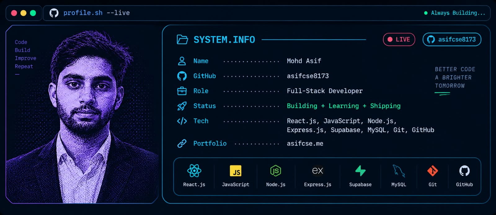

<!-- ========================= -->
<!--         BANNER            -->
<!-- ========================= -->

<p align="center">
  
</p>

<br/>

<!-- ========================= -->
<!--          INTRO            -->
<!-- ========================= -->

<h1 align="center">
  Hi 👋, I'm Mohd Asif
</h1>

<p align="center">
  <b>Final-Year CSE Student • Full-Stack Developer • Problem Solver</b>
</p>

<p align="center">
  <a href="https://github.com/asifcse8173">
    
  </a>
  <a href="https://www.linkedin.com/in/mohd-asif-8959b4301/">
    
  </a>
  <a href="https://asifcse.me">
    
  </a>
</p>

---

## 👨‍💻 About Me

I'm **Mohd Asif**, a final-year Computer Science & Engineering student
focused on building modern, responsive and practical web applications.

I enjoy turning real-world problems into useful software products,
while continuously improving my skills in frontend development,
backend development, databases and software engineering.

- 🎓 Final-Year B.Tech CSE Student
- 💻 Full-Stack Development
- ⚛️ Currently focusing on React.js
- 🌱 Learning backend development with Node.js & Express.js
- 🗄️ Working with Supabase and MySQL
- 🚀 Building and deploying real-world projects
- 🔧 Interested in scalable and user-friendly applications
- 🎯 Preparing for software engineering opportunities

---

## 🛠️ Tech Stack

### 💻 Languages

<p>
  
  
  
</p>

### 🎨 Frontend

<p>
  
  
</p>

### ⚙️ Backend

<p>
  
  
</p>

### 🗄️ Database

<p>
  
  
</p>

### 🔧 Tools & Platforms

<p>
  
  
  
  
</p>

---

# 🚀 Featured Projects

## 🏠 HostelCare AI

**Smart Hostel Complaint & Operations Management Platform**

A full-stack platform designed to digitize hostel complaint
submission, tracking and administration.

### Features

- 👨‍🎓 Student portal
- 📝 Complaint submission
- 📊 Complaint status tracking
- 👨‍💼 Warden/Admin dashboard
- 🚨 Complaint priority management
- 💬 Remarks and resolution tracking
- 🗄️ Supabase database
- 📱 Responsive interface
- 🤖 AI-assisted complaint management concepts

**Tech Stack:**

`React.js` `Node.js` `Express.js` `Supabase`

<p>
  <a href="https://github.com/asifcse8173/hostelcare">
    
  </a>
</p>

---

## 💼 Developer Portfolio

A responsive personal portfolio showcasing my projects,
skills, experience and development journey.

**Tech Stack:**

`React.js` `JavaScript` `CSS`

<p>
  <a href="https://asifcse.me">
    
  </a>
  <a href="https://github.com/asifcse8173/my-portfolio">
    
  </a>
</p>

---

## 🔎 Google Search Frontend

A frontend implementation inspired by Google Search,
Google Image Search and Advanced Search interfaces.

**Tech Stack:**

`HTML` `CSS` `JavaScript`

<p>
  <a href="https://github.com/asifcse8173">
    
  </a>
</p>

---

## 🏥 Smart Hospital Queue Management System

A project concept focused on improving patient queue and
appointment management for hospitals and clinics.

### Planned Features

- 👤 Patient registration
- 🏥 Department selection
- 👨‍⚕️ Doctor selection
- 🎫 Digital token / parchi
- 📱 Live queue status
- ⏱️ Estimated waiting time
- 🚨 Emergency priority
- 📅 Appointment management

---

# 📊 GitHub Statistics

<p align="center">
  
  
</p>

> These statistics can later be moved to a self-hosted
> GitHub Readme Stats instance for better reliability.

---

# 🐍 Contribution Snake

<p align="center">
  <picture>
    <source
      media="(prefers-color-scheme: dark)"
      srcset="https://raw.githubusercontent.com/asifcse8173/asifcse8173/output/github-contribution-grid-snake-dark.svg"
    />
    <source
      media="(prefers-color-scheme: light)"
      srcset="https://raw.githubusercontent.com/asifcse8173/asifcse8173/output/github-contribution-grid-snake.svg"
    />
    
  </picture>
</p>

---

# 📈 My Development Journey

```text
HTML / CSS
     ↓
JavaScript
     ↓
React.js
     ↓
Node.js + Express.js
     ↓
Supabase + MySQL
     ↓
Full-Stack Development
     ↓
Real-World Projects
     ↓
Continuous Learning 🚀
